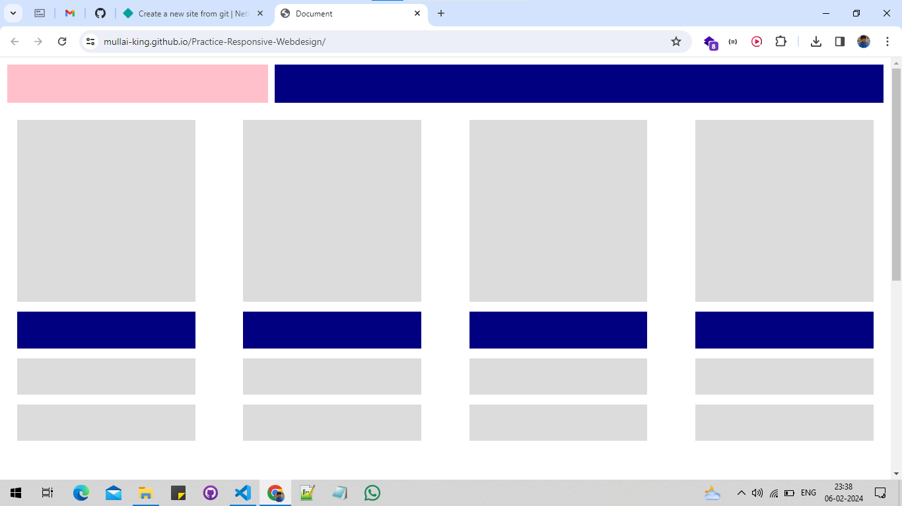
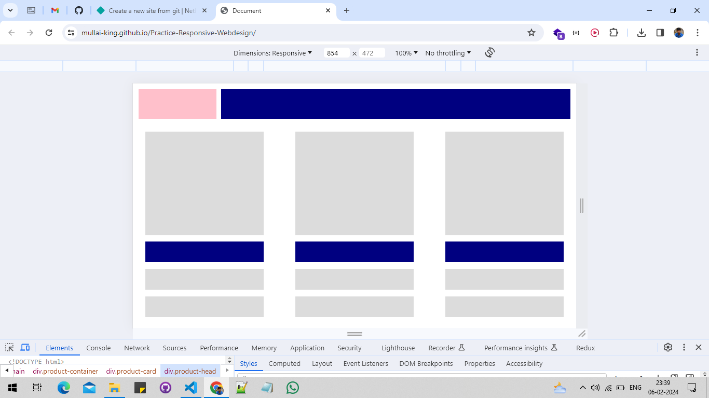
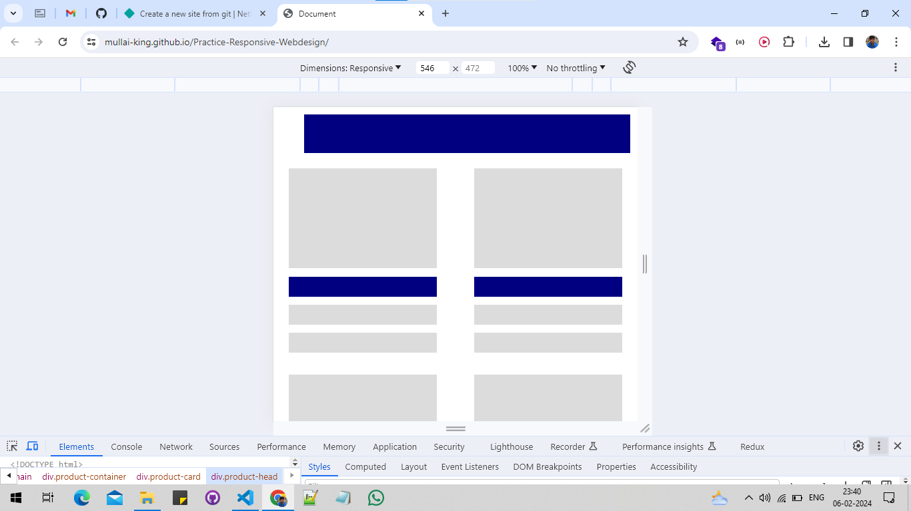
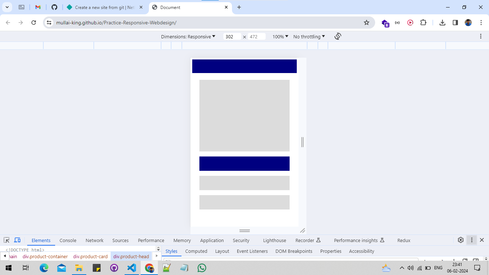

# This respository has a code of responsive
 -  web design with help of HTML and CSS with help of media queries
 -  I design web page like given image.

## [Click here. To see deployed page](https://mullai-king.github.io/Practice-Responsive-Webdesign/)

- *Extra Large Screen*

- *Large Screen*

- *Medium Screen*

- *small Screen*
